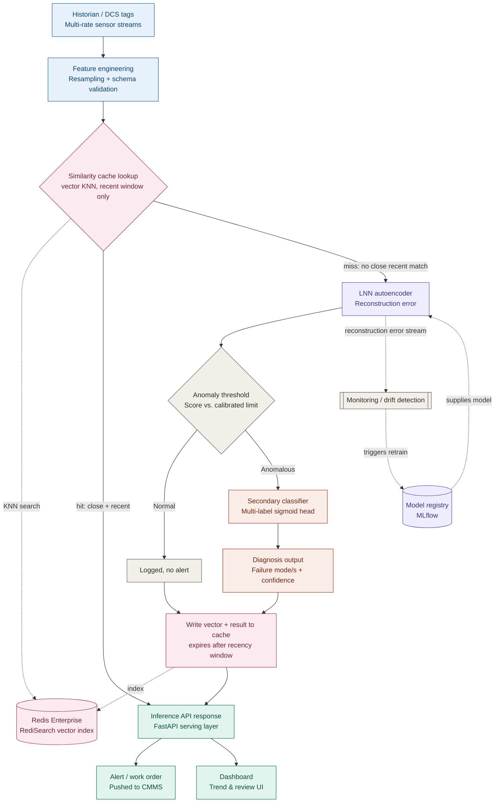

# LNN Compressor Anomaly Detection — Inference Pipeline Architecture

## Legend

- **Blue** — data ingestion / serving layer
- **Purple** — model artifacts (LNN autoencoder, registry)
- **Gray** — neutral / decision / monitoring
- **Coral** — anomaly diagnosis path
- **Teal** — feature engineering
- **Pink** — Redis similarity caching layer (vector KNN, cache-aside pattern)

Solid arrows = request-time data path. Dotted arrows = supporting infrastructure
(model registry supplying the deployed model; similarity cache lookup/write;
monitoring loop watching the reconstruction-error stream to trigger retraining).

## Caching notes

- **Cache type**: similarity-based, not exact-key. A new feature window is
  compared against recent cached windows using vector KNN (cosine or L2
  distance) — if a close-enough match exists, reuse its prediction instead of
  running the model.
- **Why recency matters as much as distance**: candidates must be both close
  *and* recent (e.g. last few hours). Old "normal" snapshots are never
  eligible matches no matter how close, so a genuinely drifting process
  eventually stops matching anything cached and forces fresh inference —
  this is what stops the cache from masking a slow-developing fault like
  DGS degradation.
- **Distance threshold**: calibrate empirically — measure how reconstruction
  error changes as a function of feature-space distance on known-normal data,
  and set the threshold well below where that relationship starts moving.
- **Infra requirement**: needs Redis with the RediSearch module for vector
  KNN/HNSW indexing — plain OSS Redis doesn't support this. On Azure, that
  means the Enterprise tier of Azure Cache for Redis (or Azure Managed
  Redis) specifically; Basic/Standard/Premium tiers don't support it.
- **What's still recomputed on every request**: the feature engineering step
  itself — only the model forward pass is skippable on a cache hit.