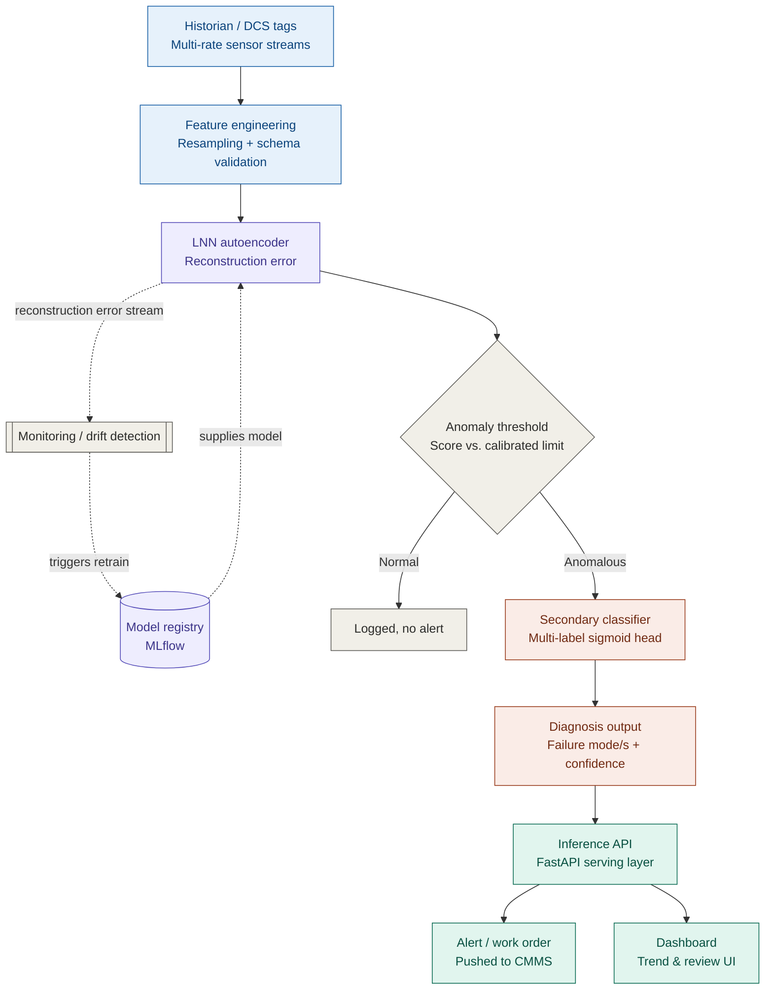

# LNN Compressor Anomaly Detection — Inference Pipeline Architecture

## Legend

- **Blue** — data ingestion / serving layer
- **Purple** — model artifacts (LNN autoencoder, registry)
- **Gray** — neutral / decision / monitoring
- **Coral** — anomaly diagnosis path
- **Teal** — feature engineering

Solid arrows = request-time data path. Dotted arrows = supporting infrastructure
(model registry supplying the deployed model; monitoring loop watching the
reconstruction-error stream to trigger retraining).